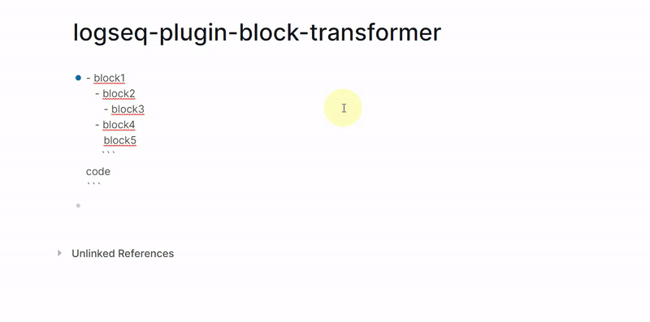
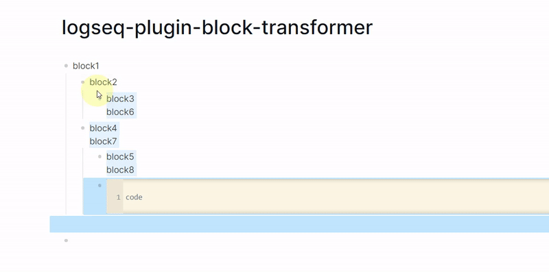
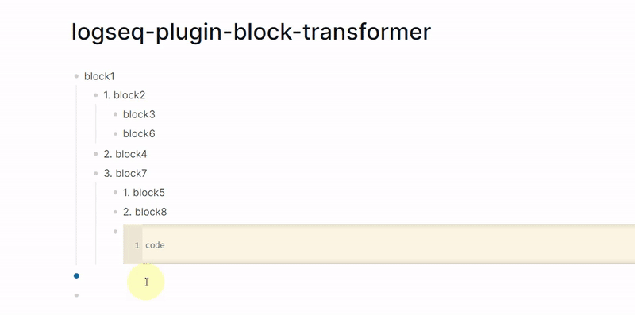
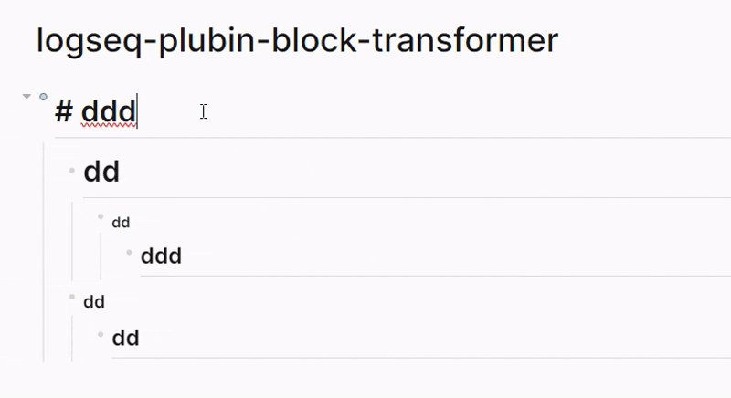

# Logseq Plugin: Block Transformer

[](https://opensource.org/licenses/MIT)

## Overview

Logseq Plugin: Block Transformer is a Logseq plugin designed to split one or multiple blocks into multiple Logseq blocks using line breaks and Markdown lists. This plugin helps you organize and manage your notes more efficiently.

## Features

### 1. Split One Block into Multiple Blocks

With this plugin, you can split a single Logseq block into multiple blocks. This is useful for breaking long text into smaller segments to improve readability.



### 2. Split Multiple Blocks into Multiple Blocks

Not only can you split one block, but you can also split multiple blocks into even more blocks. This is helpful for reorganizing your notes and adding more details.



### 3. Ordered Lists Remain Ordered

If the original block contains an ordered list, the split blocks will maintain the ordered list format.



### 4. Hierarchical Headers

The plugin can intelligently apply and adjust heading levels to maintain a clear document structure. When the `useHeader` option is enabled in a mode, it recursively processes the selected blocks and their children, ensuring that a child block's heading level is always one greater than its parent's. This is perfect for creating well-structured outlines from nested blocks.


### 5. Change Block Heading Level

This feature provides an enhanced way to change the heading level of a block, with the key advantage of being able to handle blocks that have leading hidden newline characters, a situation where Logseq's native heading shortcuts might not work as expected.

**Note:** This feature is disabled by default. To use it, you need to enable `enableHeaderShortcuts` in the plugin settings.

The available shortcuts are:
- `ctrl+0` (or `cmd+0` on macOS): Reset to a normal text block.
- `ctrl+1` (or `cmd+1` on macOS): Change to Heading 1.
- `ctrl+2` (or `cmd+2` on macOS): Change to Heading 2.
- `ctrl+3` (or `cmd+3` on macOS): Change to Heading 3.
- `ctrl+4` (or `cmd+4` on macOS): Change to Heading 4.
- `ctrl+5` (or `cmd+5` on macOS): Change to Heading 5.
- `ctrl+6` (or `cmd+6` on macOS): Change to Heading 6.

## Usage

1.  **Select Blocks**: Choose one or more blocks in Logseq that you want to transform.
2.  **Open Toolbar**: Click the **Block Transformer** icon in the Logseq toolbar. This will open a panel where you can manage and customize transformation modes.
3.  **Configure Modes**: In the panel, you can:
    *   **Switch between modes**: Select the active transformation mode from a list of presets (e.g., "Split", "Header", "Full").
    *   **Edit modes**: Adjust the settings for each mode, such as whether to split by lines, convert bold to headers, or handle code blocks.
    *   **Add/Remove modes**: Create new custom modes or delete existing ones to fit your workflow.
4.  **Transform**: Once your modes are configured, press the transform shortcut (`ctrl+t` by default) to apply the currently active mode's settings to your selected blocks. You can also switch between modes quickly using `ctrl+shift+t`.

This system allows for powerful customization directly from the UI, letting you define multiple transformation styles and switch between them easily.

## Settings

The plugin's behavior is primarily controlled through **Transform Modes**, which are fully editable from the toolbar panel. Here are the core concepts:

| Key | Description | Type | Default |
| --- | --- | --- | --- |
| `transformModes` | A list of customizable transformation profiles. Each mode has its own set of rules. | `object[]` | See below |
| `activeModeId` | The ID of the currently active transformation mode. | `number` | `1` |
| `transformShortcut` | Keyboard shortcut to apply the active transformation mode. | `string` | `ctrl+t` |
| `transformModeShortcut` | Keyboard shortcut to cycle through the available transformation modes. | `string` | `ctrl+shift+t` |
| `enableHeaderShortcuts` | Enable shortcuts (`ctrl+0` to `ctrl+6`) to change heading levels. | `boolean` | `false` |

### Default Transform Modes

The plugin comes with four default modes:

1.  **Split**: Splits blocks by newlines and list items.
2.  **Header**: Converts markdown heading syntax within blocks to actual block headers.
3.  **Split+Header**: Combines the functionality of the first two modes.
4.  **Full**: A comprehensive mode that splits blocks, handles headers, converts ordered lists to non-ordered, and turns bolded text into headers.

### Mode Options Explained

When you edit or create a transform mode, you can configure the following options based on the logic in [`src/block_handler.ts`](src/block_handler.ts):

| Option | Description |
| --- | --- |
| `name` | The display name for the mode in the toolbar UI. |
| `useSplit` | If enabled, splits a block's content into multiple new blocks based on line breaks, list items (`-`, `*`, `1.`), and tables. This effectively unnests content within a single block into separate, structured blocks. |
| `useHeader` | If enabled, this option recursively traverses the selected blocks and their children, applying hierarchical heading levels. It ensures that child blocks have a heading level exactly one greater than their parent, creating a structured outline. This affects existing content that looks like a header. |
| `removeEmptyLine` | When `useSplit` is active, this will cause any empty lines in the original block(s) to be discarded instead of being turned into empty blocks. |
| `splitCodeBlock` | When `useSplit` is active, this allows the content inside code fences (```) to be split. If disabled, the entire code block is treated as a single unit. |
| `orderedToNonOrdered` | If enabled, converts ordered list items (e.g., `1. First`) into non-ordered list items (e.g., `- First`). It also removes numbering from lines that are converted to headers. |
| `boldToHeader` | If enabled, any line that is only **bold text** (and optional trailing punctuation) will be converted into a header during the `useHeader` action. |
| `removeTailPunctuation` | When converting text to a header (e.g., with `boldToHeader`), this option removes any trailing punctuation marks like commas or periods. |
| `maxHeaderLevel` | Sets the maximum heading level (from 1 to 6) that the `useHeader` action can apply. |

**Note:** All settings, including shortcuts and modes, can be modified. If you change a shortcut, you may need to restart Logseq for it to take effect.

## License

Logseq Plugin: Block Transformer uses the MIT license. For more details, please refer to the [LICENSE](LICENSE) file.

---

**Note:** Make sure that Logseq is installed and running before using the plugin.

If you encounter any issues or have suggestions while using the plugin, please feel free to reach out. We are committed to improving it.

Thank you for using the Logseq Plugin: Block Transformer!